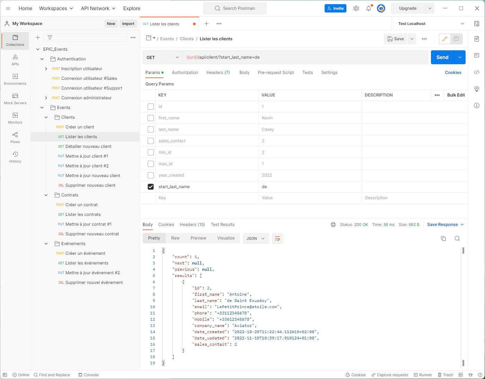
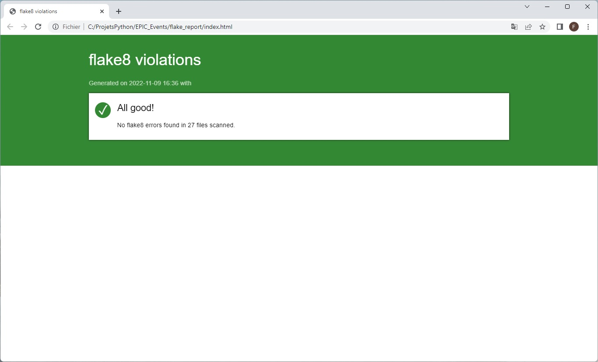

[](https://docs.python.org/fr/3.10/)
[](https://www.postgresql.org/docs/15/index.html)
[](https://docs.djangoproject.com/fr/4.1/)
[](https://pyjwt.readthedocs.io/en/2.6.0/)

# EPIC_Events

## Table des matières
1. [Informations générales](#Informations-générales)
2. [Technologies](#Technologies)
3. [Installation](#Installation)
4. [Paramétrage](#Paramétrage)
5. [Exécution](#Exécution)
6. [Vue générale des API et documentation](#Documentation-API)
7. [Conformité du code aux directives PEP 8](#Conformité-PEP-8)

## Informations générales
***
Serveur CRM avec une base de données PostgreSQL
- ensemble d’endpoints sécurisés à l'aide du framework Django REST
- opérations CRUD (créer, lire, mettre à jour et supprimer) accessibles via l'API aux utilisateurs autorisés et 
appliquées aux divers objets CRM
- interface front-end simple à l'aide du site d'administration Django, laquelle permet aux utilisateurs autorisés
de gérer l'application, d'accéder à l'ensemble des modèles et de vérifier la configuration de la base de données

## Technologies
***
Technologies ou packages majeurs utilisés dans ce projet :
* [Windows 11 Famille](https://learn.microsoft.com/fr-fr/windows/whats-new/windows-11-overview) : version 21H2 
* [PostgreSQL](https://www.postgresql.org/docs/15/index.html) : version 15.0
* [python](https://docs.python.org/fr/3.10/) : version 3.10.8
* [django](https://docs.djangoproject.com/fr/4.1/) : version 4.1.2
* [django REST framework](https://www.django-rest-framework.org/) : version 3.14.0
* [JWT](https://pyjwt.readthedocs.io/en/2.6.0/) : version 2.6.0

## Installation
***
Réalisez l'installation sous Windows avec le terminal PowerShell 

Le clonage (git clone) se fait dans un répertoire EPIC_Events. Installez les dépendances du projet après 
avoir généré et activé l'environnement virtuel.
```
$ git clone https://github.com/FredericTNT/EPIC_Events
$ cd EPIC_Events
$ python -m venv venv
$ venv/Scripts/activate
(venv)$ pip install -r requirements.txt
```
Rendez-vous dans l'outil d'administration de votre serveur de bases de données postgreSQL et créez une base vide
**EPIC** avec les valeurs de 'USER', 'PASSWORD', 'PORT' figurant dans le fichier **settings.py** du projet
(vous pouvez également modifier ces valeurs avec vos propres paramètres).
```
DATABASES = {
    'default': {
        'ENGINE': 'django.db.backends.postgresql',
        'NAME': 'EPIC',
        'USER': 'OpenClassrooms',
        'PASSWORD': 's3cr3T',
        'HOST': 'localhost',
        'PORT': '5432',
    }
}
```
Dernière étape avant la première exécution, vous devez générer le schéma de la base de données avec le programme
de migration automatique.
```
(venv)$ python manage.py makemigrations
(venv)$ python manage.py migrate
```

## Paramétrage
***
Au niveau des autorisations utilisateurs, l'application repose sur l'affectation de permissions pour chaque objet CRM
(Client, Contract, Event) dans des groupes d'utilisateurs. Deux groupes doivent exister (équipe commerciale et équipe
support) et leur nom par défaut est paramétrable dans le fichier **settings.py** du projet. Il est nécessaire que
les noms soient identiques dans le fichier et dans la table GROUPE accessible via le site d'administration.

```
TEAMS = {
    'SALES': 'Sales',
    'SUPPORT': 'Support',
}
```

## Exécution
***
Le serveur d'application se lance en exécutant le programme manage.py dans l'environnement virtuel activé.

```
(venv)$ python manage.py runserver
```

Lorsque le serveur fonctionne, l'application est accessible via un navigateur web à l'url suivante :
http://localhost:8000/

## Documentation API
***
API - Collection Postman



**Postman** [Documentation des API](https://documenter.getpostman.com/view/19243581/2s8YeixwEX)

## Conformité PEP 8
***
La vérification de conformité du code aux directives PEP 8 peut s'effectuer en exécutant le programme flake8.exe 
à partir du répertoire courant EPIC_Events avec les paramètres suivants et l'installation préalable des deux modules 
flake8 et flake8-html dans l'environnement virtuel activé :
```
(venv)$ pip install flake8
(venv)$ pip install flake8-html

(venv)$ venv\scripts\flake8 --show-source --statistics --max-line-length=120 --exclude=migrations --format=html --htmldir=flake_report epic, authentication, events, tests

```
Un rapport index.html est généré dans le sous-répertoire flake_report avec la liste des éventuels points de
non-conformité.



<!---
## FAQs
-->
